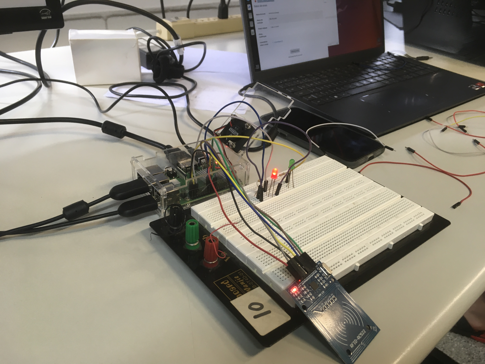
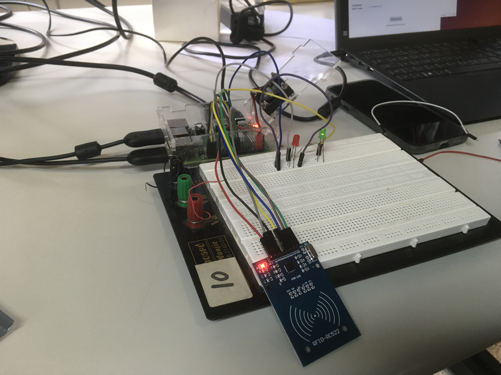

# SEL-0337 - Prática 6
Neste projeto, foram desenvolvidos duas práticas visando o uso de dois periféricos de uma Raspiberry Pi: um módulo de câmera e uma tag RFID. Além disso, o projeto tem o intuito de introduzir sobre o controle de versões de programa via Git/Github.

# TAG RFID
Nesta parte da prática, foi desenvolvido um programa em python que foi capaz de gravar um texto com uma combinação dos números USP da dupla pelo módulo de identificação por rádio frequência e exibir o ID da tag utilizada no terminal da Raspi. Posteriormente, utilizou-se o mesmo código para a verificação do ID da tag no módulo de identificação e o respectivo print de "Acesso liberado" com o acendimento de um LED verde ou o print de "Acesso negado" com o acendimento de um LED vermelho.
Foi utilizado para isso, um módulo RFID-RC522 operando com High Frequency. A comunicação com a Raspiberry Pi é feito através da SPI. O programa desenvolvido está no código TAG.py deste repositório.
Nas imagens a seguir estão apresentadas fotografias de execução da prática. A primeira representa a montagem do circuito com os LEDs, seus respectivos resistores e o módulo de identificação, a segunda representa o acesso liberado e a terceira, o acesso negado.

# CÂMERA
O propósito do projeto da câmera era criar um circuito no qual, quando o código identificasse um rosto à frente da câmera, o LED seria aceso, indicando acesso liberado para a pessoa. Enquanto não houvesse pessoas à frente da câmera, o LED permaneceria apagado, indicando acesso negado.

Para realizar o reconhecimento facial, foi utilizado a biblioteca OpenCV e o método Haar Cascade, este obtido no algoritmo haarcascade_frontalface_default. Ao detectar a presença de uma pessoa à frente da câmera, o sistema iniciava o processo de captura de fotos do rosto da pessoa, armazenando-as na pasta "detected_faces". Esse procedimento permitiria registrar a movimentação das pessoas naquele local, e as imagens seriam referenciadas com a data do evento da foto.
